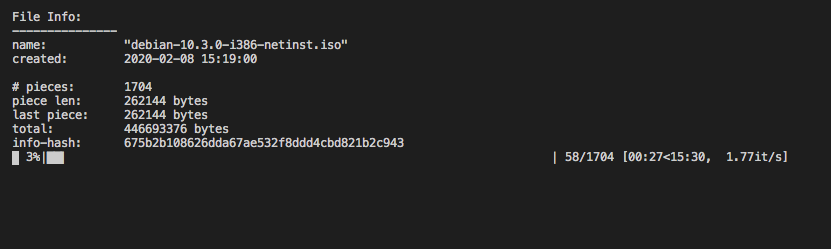

# БTorrent (bTorrent)


This is my fully functional [BitTorrent](https://en.wikipedia.org/wiki/BitTorrent) client written from scratch in Python.

### How to run?

Make sure your `.torrent` file is in the same directory as `main.py`

```bash
pip3 install -r requirements.txt
python3 main.py
```

### Includes

- Fast, concurrent p2p exchange
- Single file torrents
- Multi-file torrents
- Multi-directory torrents
- UDP/HTTP trackers
- SHA1 hash checks of all pieces
- Random piece selection (improves speed)

### What is a BitTorrent client?

Traditionally, files are downloaded from a single server. You (the client), ask the server to send you some file and the server replies by sending it to you in chunks. This is bad if the server goes down, or if the connection is poor, and it's also very boring from a programming perspective.

BitTorrent is a protocol in which there is no single/central server (it's decentralized). BitTorrents work via peer-to-peer communication where peers (clients) exchange tiny pieces of the original file with each other until they collect the whole thing. That's a lot more fun!

To download a file via the BitTorrent protocol, one must roughly follow these steps:

1. Download, and parse the .torrent file (this is small bencoded file containing information about the actual file)
2. Connect to a tracker listed in the .torrent file, and request a set of peers
3. Once you know the peers, connect to each one, and send a handshake
4. After a few more exchanges, you should know which parts of the file every peer has and which parts they don't
5. Start asking for pieces of the file you don't have, and keep asking until you collect the entire file
6. Write each collected piece of the file to its correct position (if there are multiple files then you should break the downloaded chunk up into their respective lengths)
7. You are done, you can now either seed the file or sever all communication

Sounds kind of complicated, right?

### Footnotes

`БTorrent`, where `Б` is the Russian `B` and it stands for ... well, Boris. If you run the client, you will notice that the client_id is also `-Bs0001-` 😉 

This client was written entirely from scratch in Python3 by Boris Skurikhin (for learning purposes, *not production*).
However, this could not be possible without:
- [Twisted](https://twistedmatrix.com/trac/)
- [bCoding](https://pypi.org/project/bcoding/1.4/)

### User Interface (v1.0)

This is what the UI looks like right now - downloading Debian:



