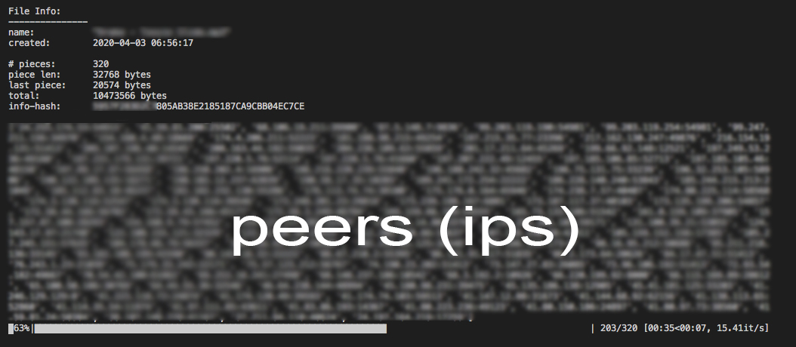

# bitTorrent v1.1

This is my [BitTorrent](https://en.wikipedia.org/wiki/BitTorrent) client written in Python. I am still working on it.

### v1.0
- Single file download through concurrent communication with multiple peers
- Supports UDP trackers only (for now)
- Doesn't support multiple torrents/files
- Verifies SHA1 hashes to ensure integrity
##### &nbsp;&nbsp;&nbsp;&nbsp;v1.1
- Added support for multiple files (but not directories)

### What is a BitTorrent client?

A BitTorrent client is a computer program designed for peer-to-peer file sharing using the BitTorrent protocol.

### Footnotes

This client was written entirely from scratch in Python3 by Boris Skurikhin (for learning purposes, *not production*).
However, this could not be possible without:
- [Twisted](https://twistedmatrix.com/trac/)
- [bCoding](https://pypi.org/project/bcoding/1.4/)

### User Interface (v1.0)

This is what the UI looks like right now *(no music was illegally distributed in the making this screenshot)*:

